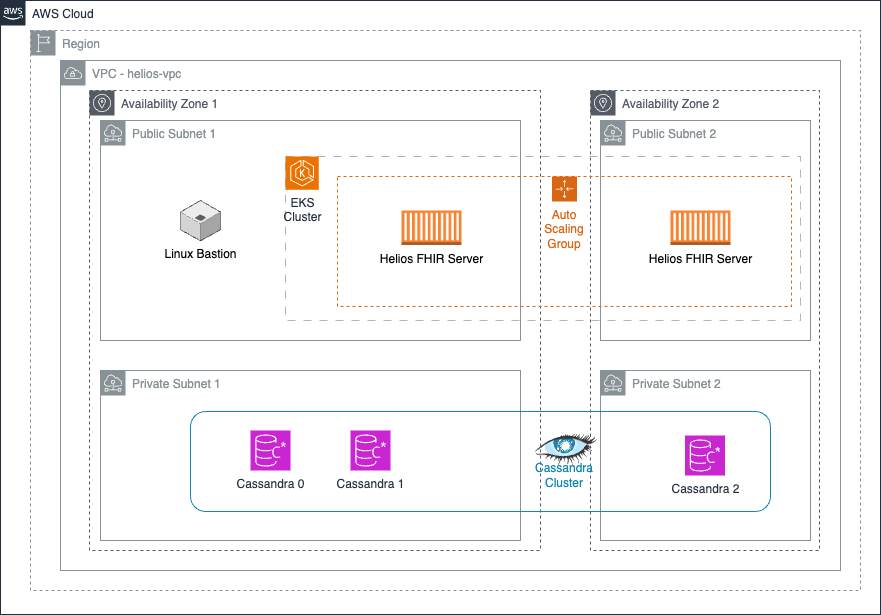

# Helios FHIR Server AWS Reference Architecture

## Introduction
This document provides recommended practices and a comprehensive setup instructions for a reference architecture for the Helios FHIR Server on AWS.

## Reference Architecture
This reference architecture consists of the following components:
- An Amazon Virtual Private Cloud (helios-vpc)
- Public and private subnets across two different availability zones for a total of 4 subnets.
- A bastion Linux instance used to provide secure access to Linux instances located in the private and public subnets of your virtual private cloud.  SSH to this instance to perform initial Cassandra cluster installation tasks, and occasional maintenance as required.
- Configuration for using [AxonOps](https://axonops.com/) - a cloud native solution to monitor, maintain and backup your Cassandra cluster.
- A 5-node Cassandra Cluster with nodes spread across two availability zones.
- Helios FHIR Server installed in an Amazon EKS Cluster and configured for auto-scaling.
- IAM Roles and Policies
- Security Groups



## Installation Prerequisites

- [Install Terraform](https://developer.hashicorp.com/terraform/install) on your local machine.
- Have an [AWS IAM User Account](https://aws.amazon.com/iam) and [create access keys](https://docs.aws.amazon.com/IAM/latest/UserGuide/id_credentials_access-keys.html#Using_CreateAccessKey). In order to successfully provision this reference architecture the user must also be permitted to create the following AWS resources:
  - VPC - AmazonVPCFullAccess
  - EC2 - AmazonEC2FullAccess
  - IAM Role - IAMFullAccess
  - EKS - You will need to add a custom policy named EKS-Full-Access
    - `{
      "Version": "2012-10-17",
      "Statement": [
      {
      "Sid": "eksadministrator",
      "Effect": "Allow",
      "Action": "eks:*",
      "Resource": "*"
      }
      ]
      }`
  - Subnet
  - Route Table
  - Route Table Association
  - Security Group
  - Load Balancer (Application, Network, or Classic Load Balancer)
  - Launch Configuration
  - Auto Scaling Group
  - Target Group (if using Application or Network Load Balancer)
  - CloudWatch Alarm
  - IAM Instance Profile
  - IAM Role Policy
  - Route 53 (optional)


## Installation Overview
There are two high level steps in this automation:

1. Use Terraform to provision the resources in the `terraform` folder.
2. SSH to the Bastion Linux instance and run Ansible automation to provision Cassandra cluster on the Linux hosts provisioned in step 1.

## Installation Steps

### Preparation ###
1. Clone this repository.
2. At the root of this repository, manually create the following file.
```
./.aws/config
```
3. Add the following content to ./.aws/config
```
export AWS_ACCESS_KEY_ID=<AWS_ACCESS_KEY_ID>
export AWS_SECRET_ACCESS_KEY=<AWS_SECRET_ACCESS_KEY>
export AWS_DEFAULT_REGION=<AWS_DEFAULT_REGION>
export ANSIBLE_HOST_KEY_CHECKING=false
```
4. Run `source ./.aws/config`
5. Run `cd terraform`
6. Run `terraform init`

### Configure Terraform Variables ###

The `variables.tf` file contains several variables that you may want to modify such as specific AWS Regions, Zones and other settings.

- Required - Replace the local_ssh_pubkey default value to ~/.ssh/id_rsa.pub or ~/.ssh/id_ed25519.pub (default)  This automation uses your pre-existing public key to access the remote Linux Bastion instance.  If you don't yet have one in the `~/.ssh` folder, create one with this command `ssh-keygen -t ed25519`

### Run Terraform Apply ###

Run `terraform apply`

The provisioning will take a while but the command execution should show the progress.

### SSH to the Bastion Linux Instance ###

The bastion public IP address can now be found in the AWS EC2 console named `Helios Bastion Server`.

From your local machine, connect to the instance:

`ssh ubuntu@[bastion ip address]`

Please NOTE:  It may take some time for the setup steps of the Bastion instance to complete.  The steps will be complete when the `/home/ubuntu/.ssh/id_ed25519` is available on the Bastion instance. 

### Clone this Repository (again) ###

From the Bastion Linux Instance, clone this repository.

`git clone https://github.com/HeliosSoftware/hfs-install.git`

Create the .aws directory 

`mkdir hfs-install/.aws`

### Copy your local .aws/config file to the Bastion Linux Instance ###

Logout of the bastion linux instance, or use a new local terminal, and execute this next command on your local machine from the `hfs-install/.aws` directory:

`logout`

`cd ../.aws`

`scp config ubuntu@[bastion ip address]:~/hfs-install/.aws/config`

Connect again to the Bastion instance.

`ssh ubuntu@[bastion ip address]`

Verify that the .aws/config file is present and correct

`cat hfs-install/.aws/config`

### Execute Cassandra Ansible Setup Scripts fom the Bastion Linux Instance ###

`ssh ubuntu@[bastion ip address]`

```
cd hfs-install
source .aws/config
cd ansible
bash apache-cassandra-axonops.sh
```

### Starting Cassandra ###
Use the following command to start the cluster from the `ansible` folder.
```
bash start-cassandra.sh
```
